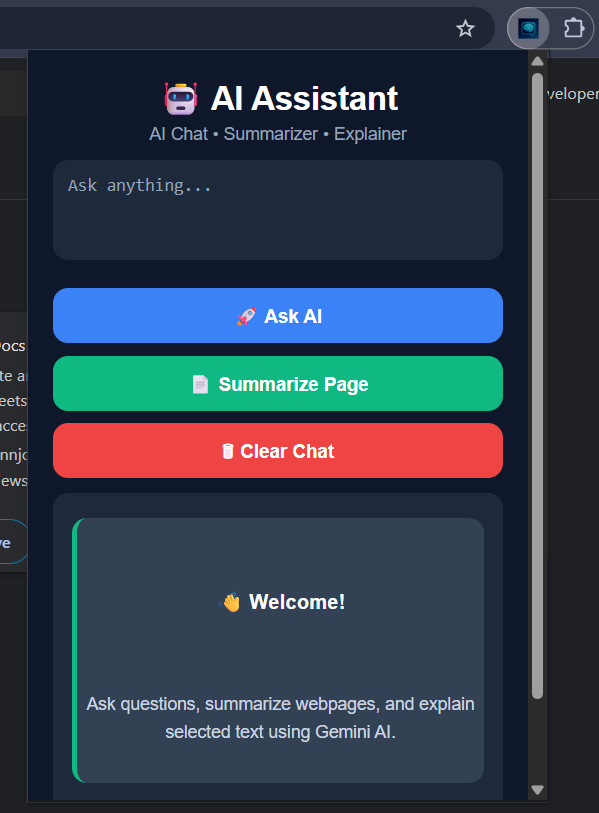
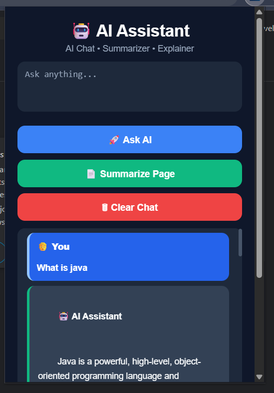
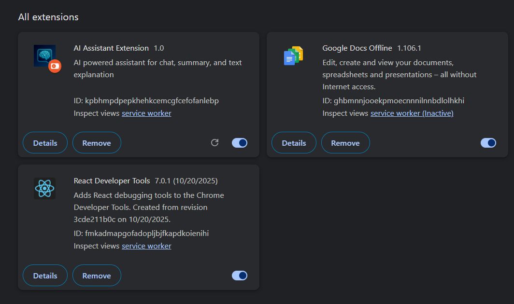

# 🤖 AI Assistant Chrome Extension

An AI-powered Chrome Extension built using JavaScript, Chrome Extension APIs, and Google Gemini API.

This extension allows users to chat with AI, summarize webpages, and explain selected text directly inside the browser.

---

## 🚀 Features

- 💬 AI Chat Assistant
- 📄 One-click Webpage Summarization
- 🧠 Explain Selected Text using Right Click
- 💾 Persistent Chat History
- 🎨 Modern Dark UI
- ⚡ Powered by Google Gemini AI
- 🧹 Clear Chat Functionality
- ⌨️ Enter Key Support

---

## 🛠️ Tech Stack

- HTML5
- CSS3
- JavaScript (ES6)
- Chrome Extension API
- Google Gemini API

---

## 📸 Screenshots

### Home Screen



### AI Chat Demo



### Extension Installed



---

## 📦 Installation

### 1. Clone Repository

```bash
git clone https://github.com/YOUR_USERNAME/ai-assistant-chrome-extension.git
```

### 2. Open Chrome Extensions

```text
chrome://extensions
```

### 3. Enable Developer Mode

Turn ON Developer Mode from the top-right corner.

### 4. Load Extension

Click:

```text
Load Unpacked
```

Select the project folder.

### 5. Add Gemini API Key

Open:

```text
popup.js
background.js
```

Replace:

```javascript
const API_KEY = "YOUR_API_KEY";
```

with your Gemini API key.

### 6. Reload Extension

Click:

```text
Reload
```

and start using the extension.

---

## 🎯 Usage

### AI Chat

1. Open the extension.
2. Type your question.
3. Click **Ask AI**.

### Summarize Webpage

1. Open any webpage.
2. Click **Summarize Page**.
3. Receive an AI-generated summary instantly.

### Explain Selected Text

1. Select any text on a webpage.
2. Right-click.
3. Click **Explain with AI**.
4. Get a simple AI explanation.

---

## 🔮 Future Improvements

- Conversation Context Memory
- Floating AI Popup Instead of Alerts
- Copy Response Button
- Export Chat History
- Voice Input Support
- Multiple AI Models
- Settings Page for API Keys
## ⭐ Support

If you found this project useful, consider giving it a star ⭐ on GitHub.
